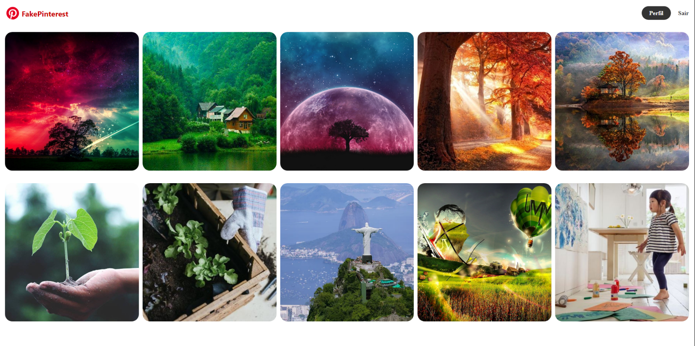
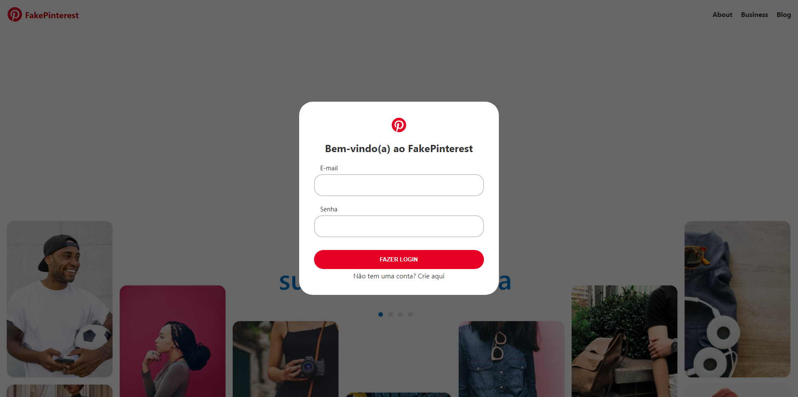
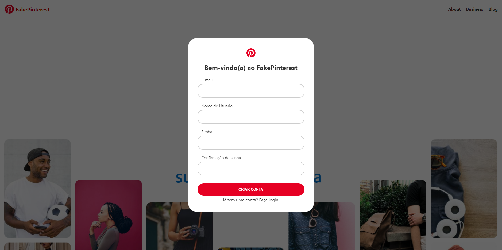

# Project FakePinterest

### Packages used:

+ flask
+ flask_sqlalchemy
+ flask_bcrypt
+ flask_login
+ flask_wtf
+ wtforms 
+ wtforms.validators
+ werkzeug.utils
+ datetime
+ os

## Project Description

This is a Web Development Project in which back-end, partial front-end and deployment was developed.
The purpose of this project is to study how Web Development works using Flask web framework.

The html files were not entirely created during this project and were adapted from an external
front-end source. The css file was also imported from the same source. This project focus mostly on
the development using Python and Flask.

## Project Structure

<ul>
    <li>The "main.py" file is responsible for running the website application while "__init__.py" initializes
    the website's configurations such as database, secret key for password encryption and folder in which
    Posts will be stored;</li>
     
    <li>"models.py" contains the User (Usuario) and Post objects creating their respective attributes;</li>
     
    <li>"forms.py" creates the form objects such as login form, create account form and post form,
    while the "routes.py" file defines each route that is related to each html page such as homepage route
    being related to the "FormLogin()" object and to "homepage.html";</li>
     
    <li>The "criar_banco.py" file creates the Database that was used to simulate the website locally before deploy.</li>
     
</ul>

## Deployment

The final step is the deployment in which case the Render Cloud Application was used as it
allows for free website deployments for simple applications. Although Render suspends
web application that are inactive for certain period of time.

## Website's Feed

## Login Page

## Create Account Page

Note 1: the forementioned external front-end course comes from an online course called
"Hashtag Treinamentos" (https://www.hashtagtreinamentos.com)

Note 2: this project has no relationship with Pinterest and was created only for academic purposes.
